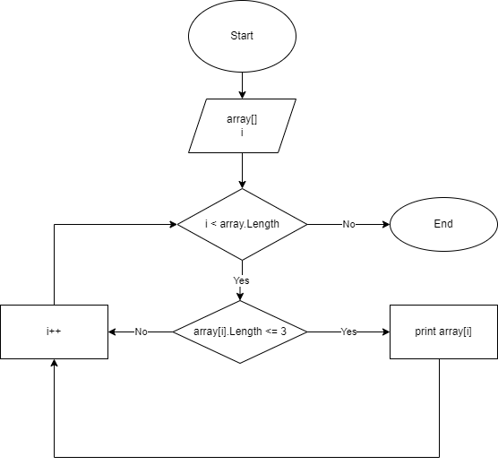

# Описание решения

## Вводные данные:
- Задаем массив элементов с определенной длиной.
- С помощью цикла вводим элементы массива до тех пор пока индекс меньше длины массива.

## Решение:
1. С помощью цикла выводим элементы массива до тех пор пока индекс меньше длины массива:

2. С помощью цикла:
- Проверяем элементы на условие: длина элемента меньше либо равна 3.
- Выводим элементы, подходящие под условие.